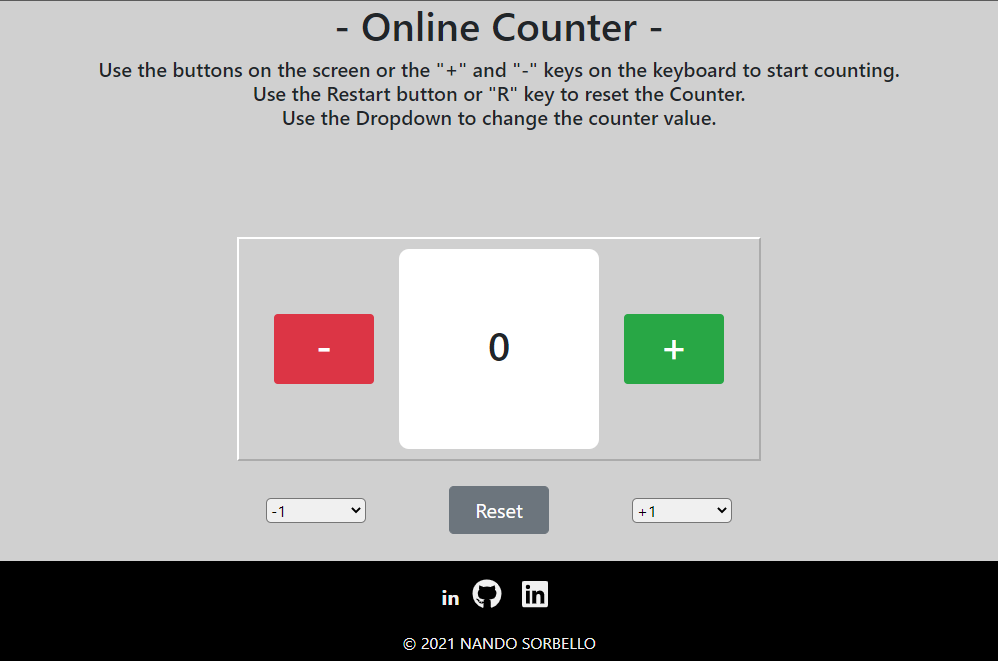

# JavaScript Online Counter
> A simple counter implemented with JavaScript. 
>It is possible to Increase, Decrease or Reset 
>the counter value with the Keyboard or the buttons on Screen. 
>It is also possible to change the Increase or Subtraction Value with the Dropdowns.

<!--Screenshot-->

## Dependencies

- Just make sure you updated your Browser to the latest version 
so that you don't encounter any problems with the compatibility of the CSS and HTML Tags.

##Structure
- The HTML page (Index) contains only the Dropdowns and Layout Divs, 
 everything else (+ / - / Reset / Counter) is implemented through JavaScript Code.

- Sections into JavaScript File:
    - Functions
    - Elements Creation
    - Listeners

##Files & Directory

1. **Root**
    - *Index.html*
    - *License.txt*
    - *Readme.md*
    - **Readme_img**
        - *icon.png*
        - *screen.png*
    - **Assets**
      - **img** 
        - *page_icon.png*
      - **css**
        - *style.css*
      - **js**
        - *script.js*
    

## Release History

* 0.0.1
    * Creation of the Repository and Upload of all files related to the page.
    

## Meta

Nando Sorbello – nandosorbello@live.it 
[LinkedIn](https://www.linkedin.com/in/nando-sorbello-290399/) - [GitHub](https://github.com/Nando784) 

Distributed under the MIT License. See ``LICENSE`` for more information.

## Contributing

1. Fork it 
2. Create your feature branch
3. Commit your changes 
4. Push to the branch 
5. Create a new Pull Request
